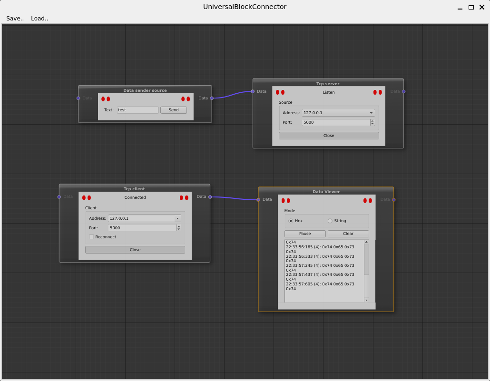
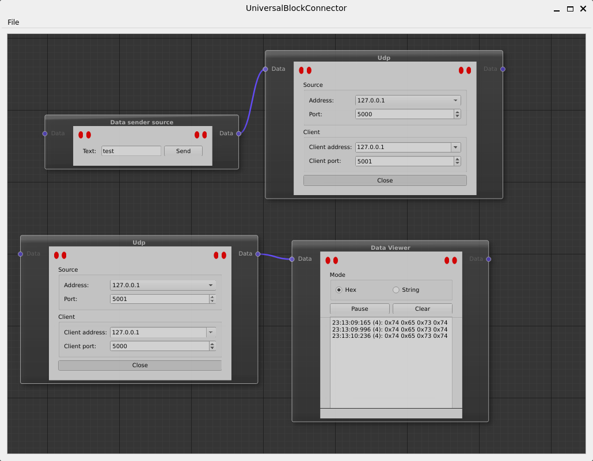
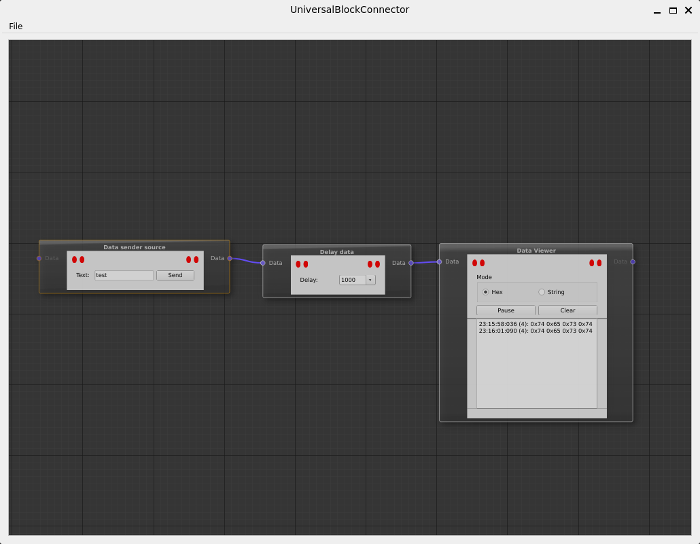
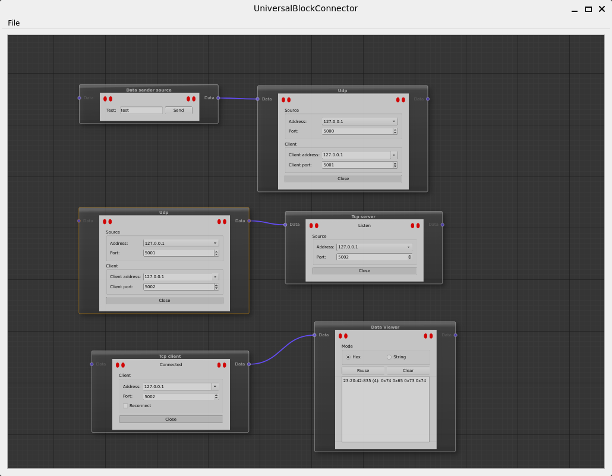

# UniversalBlockConnector

This project was inspared by idea that interfaces could connect to each other, send and receive data with modification between blocks.

Simple example that shows data transmission between tcp server and client. You could load it from (templates/TcpServerClient.flow)

Simple example that shows data transmission between udp interfaces. You could load it from (templates/UdpTransmission.flow)

Simple example that add delay between two blocks (templates/Delay.flow)

Converter from udp to tcp interfaces (templates/UdpTcpConverter.flow)
